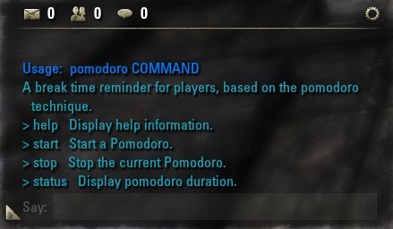
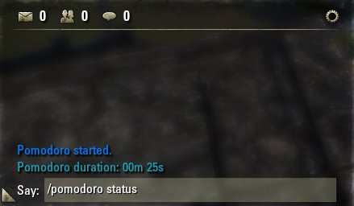

 

### Developer Environment
> Use docker to expose lua services such as lua interpreter, luarocks package manager, and the most popular lua BDD testing framework busted.

- Setup https://docs.docker.com/install/
- Build the images:  
    - `docker-compose build lua`
    - `docker-compose build luarocks`
    - `docker-compose build busted`
- Execute Tests `docker-compose run --rm busted  tests -v`

### Scripts
This `scripts` folder has scripts automating tasks such as getting busted, esoui sdks. Tools such as dos2unix, and even fetching esoui globals.

### Link src to ESO path
Storing source code inside the system feels like coding on production server :mind_blown: Let's fix that by creating a symbolic link from the source code to system:
- Open `cmd` with Admin privileges
- Paste: `mklink /d "C:\Users\rdok\Documents\Elder Scrolls Online\live\AddOns\Pomodoro" "D:\Code\Pomodoro"`

### Issues
#### File Endings
> standard_init_linux.go:207: exec user process caused "no such file or directory"
Convert file endings to Unix style: 

PowerShell:
- Fetch dos2unix:  .\tools\get_dos2unix.ps1
- PowerShell:  `{dos2unix_path} {sh file path}`
 - Example: ` .\tools\dos2unix\bin\dos2unix.exe .\docker\luarocks\entry-point.sh`

 
### Docker Cleanup
> Remove any stopped containers and all unused images. 

`docker system prune -a`
